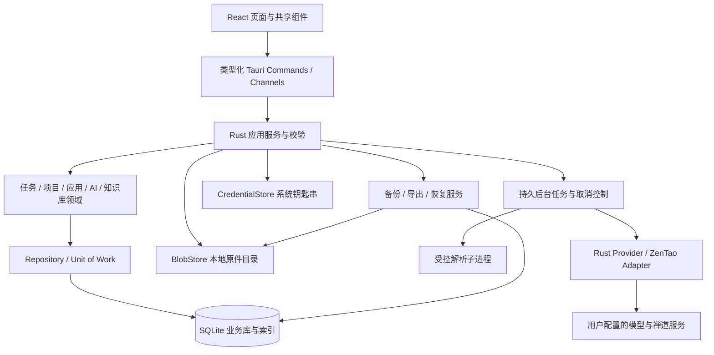

# 个人工作台架构设计

文档版本：1.0 · 2026-09-07 · 状态：已授权进入实施的开发基线

本文是目标架构，不是已实现报告。`src/` 与 `src-tauri/` 已进入开发，实际实现及与本方案的差异见 [实现记录](IMPLEMENTATION.md)；`ui/` 保留静态设计预览。首个交付目标为可安装、可持久使用的 macOS App，后续扩展 Windows。

## 1. 结论与阅读顺序

推荐 **Tauri 2 + React + TypeScript + Rust 业务层 + SQLite + 本地文件存储**。业务数据以 SQLite 为唯一权威来源，Office/PDF/图片等原件保存到应用管理的文件目录；Markdown 用于技能和知识内容的编辑、导入导出及跨工具交换。单机版本无需安装 PostgreSQL、Docker 或常驻应用服务器。

用户已确定默认数据根目录为 `~/.perch`（保持此拼写），在“设置 → 数据与备份 → 存储位置”允许更改。更改路径需迁移并校验现有数据库和附件；固定启动定位配置保存在 `~/.perch/bootstrap.json`，避免打开数据库前无法找到自定义目录。详细路径、切换及失败恢复规则见数据文档第 1 节。

| 文档 | 负责的问题 |
| --- | --- |
| [本文](ARCHITECTURE.md) | 技术选择、职责边界、模块架构、安全、桌面运行 |
| [数据与迁移](development/02-data-and-migration.md) | 实体、排期、文件一致性、备份恢复、跨数据库迁移 |
| [集成实现](INTEGRATIONS.md) | 禅道、供应商、Agent、技能、解析与知识库聊天 |
| [开发与验收](DEVELOPMENT.md) | 需求覆盖、目录、IPC、依赖、阶段任务、测试与发布 |
| [现有设计](../design.md) | 页面交互与视觉依据 |

架构确认后按开发计划实施；本轮不创建 Tauri 项目、不安装依赖、不修改预览代码，也不把示例数据迁入用户数据库。

## 2. 为什么选择 SQLite

| 方案 | 适用点 | 本产品的代价 | 决策 |
| --- | --- | --- | --- |
| SQLite | 本地事务、关联查询、离线工作、单文件便于备份 | 写入需短事务；多设备不能直接共享文件 | 首版业务库 |
| PostgreSQL | 多用户并发、中心服务、权限与 pgvector | 单机安装维护服务、端口、账号、升级和备份负担 | 后续服务端方案 |
| Markdown 文件作为全部数据库 | 易阅读、易被其他工具编辑 | 看板排序、关联、状态统计、并发编辑、事务和引用难保证 | 不作为业务主库 |
| SQLite + 管理文件 + MD/JSON 数据交换 | 兼顾可靠性、原文可携带、将来迁移 | 需制定文件事务与导出协议 | 采用 |

任务、项目、分类、模型、Agent、会话和文件引用有明确关系，需要数据库事务。Markdown 是文本格式，不提供外键、查询索引或多对象原子修改。技能正文可在 SQLite TEXT 中保持 Markdown 原文，通过导出得到 `SKILL.md`，无需为可迁移性引入两份可修改的权威数据。

PostgreSQL 的引入条件是多人协作、跨设备同步或服务端集中检索需求成立。到那时增加 API 服务及 PostgreSQL adapter；桌面通过 API 通信，可继续保留 SQLite 离线缓存。更换数据库连接字符串不足以完成迁移，还需要权限、冲突、同步游标、附件传输和独立 SQL migrations。

## 3. 明确的技术选择

| 层 | 推荐技术 | 使用边界 |
| --- | --- | --- |
| 桌面宿主 | Tauri 2、Rust、系统 WebView | macOS 使用 WKWebView；原生窗口、文件对话框、系统浏览器 |
| 前端 | React、TypeScript strict、Vite | SPA，无 SSR、无生产 Node 服务 |
| 页面路由 | React Router HashRouter | 避免打包资源路径与刷新路由冲突 |
| 业务查询缓存 | TanStack Query | 缓存 Rust 查询结果；不作为持久化存储 |
| 瞬时界面状态 | Zustand + 组件 state | 筛选、抽屉、会话草稿；不再复制全局业务数据库 |
| 表单和组件 | React Hook Form、Zod、Radix、Lucide React | 延续现有中性浅色 tokens；封装可访问性控件 |
| 样式 | CSS variables + CSS Modules | 提取现有精修样式；无需再叠加完整视觉框架 |
| 看板 | dnd-kit | 跨列、列内排序、键盘替代；兼容版本整组锁定 |
| 日历 | FullCalendar React 标准插件 | dayGrid/timeGrid/list/interaction；不使用收费资源调度插件 |
| 日期时间 | Luxon + IANA 时区；Rust 对应时区库 | 同日/跨日、全天、DST 转换与校验 |
| Rust 业务运行时 | Tokio、serde、thiserror、reqwest | 任务编排、DTO、结构化错误、真实 HTTP/SSE |
| 数据访问 | rusqlite，bundled SQLite | 单独 DB 执行器；不把阻塞 SQL 放到 UI/Tokio 核心线程 |
| schema migration | 版本化嵌入式 SQL + migration ledger | 校验和、升级前快照、事务、拒绝静默降级 |
| 全文与向量 | SQLite FTS5 + VectorIndex 接口 | 中文分词预处理；Rust 精确余弦基线，sqlite-vec 需验证后接入 |
| 凭据 | 系统 CredentialStore adapter | macOS Keychain；Windows 后续使用 Credential Manager |
| 文档解析 | Rust 文本读取 + Apache Tika/PDFBox/Office 解析器 | 随包固定版本 Java LTS runtime 与受控 launcher；不要求用户自行安装 Java/Office |
| 测试 | Vitest、Testing Library、Rust tests、Playwright | 组件/领域/持久化/浏览器；Mac 原生验收另列 |

初始化工程时选择相互兼容的稳定版本，将 pnpm、Node、Rust toolchain、Cargo.lock、pnpm-lock.yaml 一同锁定。本文不给未核验的“最新小版本”作兼容承诺。Tauri JS/Rust 插件版本、解析运行时和原生向量库必须一起验证。

## 4. 进程与依赖架构

React 负责展示、表单和交互反馈。所有任务保存、引用保护、数据库与文件访问、凭据读取、模型调用、禅道请求和迁移在 Rust 完成。前端校验用于即时提示，Rust 重复执行权威校验。

Rust 采用模块化单体：按领域拆模块，不按每个页面起服务。需要异步的同步、解析、索引和模型流由本进程作业调度。解析器可运行独立进程以隔离崩溃和控制资源，不提供公开 HTTP 端口。子进程不是安全沙箱，仍需限制可访问路径、关闭外部资源解析、限制展开大小并运行可信签名二进制。

解析推荐 Tika 是因为用户要求同时支持旧 DOC/PPT/XLS 与新 Office/PDF；代价是安装包和解析内存明显高于纯 Tauri 壳。选用随包运行时，优先保证完整格式能力与离线安装体验；纯 Rust 分散解析库可降低体积，但旧格式、表格定位与兼容测试成本更高，不作为本轮基线。P0 先实测运行时裁剪依赖、许可证、干净 Mac 启动、结构定位与签名；失败时调整解析依赖并修订方案，不能只接收旧格式而不解析。

数据库使用单写执行器，读取可复用有界连接；每个连接启用外键。网络等待、文件解析、用户确认不能占用 SQL 事务。业务服务一次提交所有关联修改，成功后才发刷新事件。前端多个视图订阅同一变更，不分别存任务数组。

## 5. 模块边界

| 模块 | 拥有的数据及行为 | 边界规则 |
| --- | --- | --- |
| Workspace | 工作空间、路径、偏好、应用版本 | 版本从打包配置读取；workspace ID 不依赖设备 |
| Projects | 项目、来源、执行关系、任务统计 | 禅道按远端键关联，改名不改 ID |
| Tasks | 本地任务、个人覆盖、排期、优先级、排序 | 本地状态与远端状态分离；完成时间与排期结束分离 |
| Calendar | 时间窗口查询、拖动/缩放排期 | 是 Tasks 的投影，无第二份事件数据库 |
| Applications | 应用、分类、Logo 引用、收藏、排序 | 分类改名/删除迁移在事务中；外链校验协议 |
| Connections | 禅道连接、同步范围、能力探测、审计 | 凭据仅通过 secret ref；明确远端写入意图 |
| Models | 供应商、协议、模型能力、测试 | 对话与 embedding 能力分开，未支持参数不盲目传递 |
| Agents / Skills | 配置、技能正文与版本、工具权限 | 导入内容不自动获得系统权限；旧会话快照稳定 |
| Chat | 会话、消息、流、取消、引用 | 流可中断恢复查看，不能伪造真实回复或引用 |
| Knowledge | 文档、提取、分块、向量空间、索引代 | 模型变更重新索引；仅查询发布成功的索引代 |
| Data Management | 备份、导出、导入、迁移、恢复 | 从首版实施可迁移协议，密钥不进普通数据包 |

共享 Repository 接口只围绕实际业务用例定义，例如 TaskRepository、ConversationRepository、BlobStore、VectorIndex。事务由应用服务统一控制，禁止每个 repository 自行提交导致跨表修改半成功。不要提前实现通用 ORM 或多租户服务框架。

## 6. 对现有设计的正式化处理

1. 复用 `ui/` 的布局、文案、颜色、页面与交互案例，在 React 中实现受控组件；不把整段 `innerHTML` 和全局事件代理原封不动带入正式程序。
2. 真实程序首次启动为空工作空间，可由用户主动载入演示空间。演示与个人空间的路径、workspace ID、同步凭据隔离。
3. 当前详情只允许同日时间，旧设计日历又要求跨日。正式版统一支持“开始日期时间 / 结束日期时间 / 时区”，默认结束日期跟随开始日期；同日快捷编辑依然存在。持久格式以数据文档为准。
4. 结束时间可选，只有开始时间的任务不得伪造已保存的时长；日历可以使用明确的临时渲染时长，编辑保存时才产生结束时间。
5. 截止日期与排期独立；完成/关闭更新状态及实际完成/关闭记录，不覆盖排期。远端执行跨月周期不自动展开为每日任务。
6. 页头状态图标与四种状态保持一致；品牌版本从 Tauri 元数据读取。应用目录在宽窗口保持四列和描述；分类管理保留父表单草稿。
7. 设置保留横向 Tab，并增加“数据与备份”“关于”两个必要管理入口。“数据与备份”提供存储路径查看、选择目录、迁移进度、恢复默认与系统文件管理器打开入口，默认路径为 `~/.perch`。主侧栏完整保留项目、任务、日历、应用、Agent、技能、知识库、聊天。
8. 禅道项目、执行、执行内任务都纳入正式接入范围；对象类型有独立标识。筛选时防止父执行与子任务被混算成相同类型的统计。
9. 模型管理现有三种协议都要完成适配：Chat Completions、Responses、Anthropic Messages；embedding 独立测试。视觉模型配置配套图片附件发送，不仅保存能力标签。

本节是正式实现对静态预览限制的补充，不声称已经改变 UI。多设备同步、多人权限、重复任务、任意脚本技能、Agent 自主操作系统、Linux 发包和 App Store 分发另设后续范围。现有要求的九类文档读取、模型调用、RAG 和禅道读取不因分阶段开发而取消。

## 7. 安全与数据出口

- Tauri capabilities 按窗口及命令最小授权。前端不开放任意 SQL、任意文件路径、任意 shell 命令或通用带密钥 HTTP 代理。
- 自定义 Rust commands 也要验证调用窗口、参数、工作空间和引用权限，不能认为安装了 capability 文件就已保护全部业务命令。
- 生产前端只加载本地打包资产，CSP 限制脚本和资源；Markdown 使用安全渲染，不允许内联 HTML、任意 iframe 或自动远程图片请求。
- 模型与禅道配置在 Rust 解析完整 URL。避免重复添加 `/v1`，禁止 URL 内凭据，跳转不跨主机携带认证头。支持用户配置的内网和 loopback 服务；非 loopback 明文 HTTP 需要显式提示和选择。
- Keychain 中保存 API Key/Token，SQLite 只存 credential reference。读取配置只回传 `hasCredential`、脱敏展示及测试状态；替换密钥是专用命令，不回填明文。
- 更改供应商或禅道目标主机须重新确认凭据关联，防止旧密钥自动发送到新站点。日志、错误、诊断和模型 tracing 不记录凭据或完整文档正文。
- 选择云端 embedding 时会发送文档分块；选择云端聊天时会发送输入、必要历史及检索片段。上传/索引和发送前显示供应商及数据去向，用户明确配置并确认后才允许发送；本地模型只是可选 endpoint，应用不承诺内置大模型权重。
- SQLite 与原件默认不提供应用级静态加密，依赖 macOS 用户权限；Keychain 仅保护凭据，不等于全文加密。数据包默认包含敏感业务正文，需在导出时提示，可另行选择经过成熟库实现的加密包。
- 恢复文件进行哈希、路径穿越、符号链接、解压大小、引用关系和 schema 兼容性校验；恢复完成不自动执行远端写操作或重新提交中断聊天。

## 8. Mac 桌面行为

首个发布目标建议 Apple Silicon/macOS 13+；Intel 作为同轮兼容目标，在真实或受支持 CI 环境完成验证后单独发布 x86_64 包。最低系统版本最终由 Tauri、解析器、Keychain 和 UI 验证确定，不能仅由构建参数宣称支持。

安装包使用 `.app` + `.dmg`。开发阶段可用本机构建；分发给其他 Mac 用户时完成 Developer ID 签名、Hardened Runtime、公证和 staple。所有嵌套运行时、解析器和动态库均进入签名检查。首版优先两个架构独立包，避免 universal 包掩盖子进程架构问题。

窗口使用原生控制按钮，保持浅色工作台；支持 Command+Q、Command+W、复制粘贴、中文输入、拖拽导入、系统文件选择、外链浏览器。Command+W 关闭窗口后主进程若继续存在，应能通过 Dock 重开；Quit 取消聊天、结束/回收子进程并保存已提交数据。单实例控制防止两个进程同时升级同一工作空间。

应用完全退出后不承诺继续索引或同步；后台作业重启恢复。睡眠期间不假设计时器继续运行，唤醒重查时间和作业租约。通知与开机启动默认关闭；提醒若实施，必须使用原生调度或明确运行限制。

自动更新是有签名的发布链路：下载与签名校验后提示重启，启动先检查 schema 兼容与升级备份。更新失败不能清空工作空间；旧二进制遇到更高 schema 应进入恢复指引，不能自动执行 down migration。

Windows 后续复用领域、Repository、React 和数据包协议，只替换系统路径、凭据、窗口、签名与安装器 adapter。SQLite 文件不能放在 iCloud/OneDrive/NAS 上作为实时多设备共享数据库。

## 9. 首版性能目标与技术验证

以下是待实测的验收目标，不是当前预览的成绩。基准建议记录 Apple Silicon、16 GB 内存、系统版本和 release 构建版本。

| 项目 | 基准数据与目标 |
| --- | --- |
| 启动 | 10,000 条任务、100 项目、50,000 消息；冷启动到可操作 P95 ≤ 3 秒，不含首次迁移 |
| 本地交互 | 同数据集，任务查询/保存 P95 ≤ 200 ms；网络及解析不阻塞输入 |
| 列表 | 分页与虚拟滚动，单页通常 50–100 行，消息不全量挂载 |
| 知识检索 | 10,000 chunks、1,024 维向量，本地检索 P95 ≤ 1 秒；embedding 网络耗时单列 |
| 内存 | 无解析任务时目标 ≤ 350 MB；解析子进程独立限额与按需退出 |
| 文件 | 单文件默认 30 MB；按页/行/单元输出有限文本，批量队列有背压 |

向量基线为 Rust 后台线程的精确余弦检索，向量保存为可校验的 float32 数据，按库/空间过滤；它是小规模正确性基线。若目标数据量下性能不达标，在同一 VectorIndex 契约下验证并接入 sqlite-vec。十万至百万分块不能凭借接口抽象就承诺相同延迟，需性能数据决定专用索引或未来服务端 pgvector。

## 10. 待确认与非阻塞假设

| 决策 | 本文推荐 | 影响 |
| --- | --- | --- |
| 单机存储 | SQLite + 管理文件 + 数据包 | 无需部署服务器；迁移通过导出/恢复 |
| 产品命名 | 暂用个人工作台，bundle ID 在首次持久化前固定 | 影响 Keychain、应用目录与升级身份 |
| Mac 支持 | Apple Silicon 优先，Intel 验证后发包 | 影响解析运行时与构建矩阵 |
| 禅道远端管理 | 默认读取，显式操作确认，按 22.0 能力开放 | 不把本地拖动映射为远端写入 |
| 文档解析体积 | 允许随安装包附带解析运行时以覆盖旧 Office | 必须在阶段 P0 实测安装体积与签名 |
| 模型使用 | 用户配置本地/云端 API，不内置模型权重 | 云端文档传输有明确数据去向 |

以上形成供用户确认的完整推荐方案。禅道实例地址/权限、真实模型 endpoint、签名证书和 Intel 机器是后续接入/发布验收的输入条件，不阻塞本文与开发计划交付。未确认前保持文档状态“待确认”，不把选型建议记作用户已经批准。

## 11. 技术依据

2026-09-07 核对：Tauri 官方架构与 sidecar 源文档、Rust IPC Channels 文档，以及 SQLite 适用场景和在线备份文档。这里的参考资料支持选型，不能替代本项目打包、权限和数据恢复实测。

- [Tauri Architecture](https://v2.tauri.app/concept/architecture/)
- [Tauri 外部二进制](https://v2.tauri.app/develop/sidecar/)
- [Tauri 调用 Rust 与 Channels](https://v2.tauri.app/develop/calling-rust/)
- [SQLite 适用场景](https://sqlite.org/whentouse.html)
- [SQLite Online Backup API](https://www.sqlite.org/backup.html)
- [SQLite WAL 说明](https://www.sqlite.org/wal.html)（实施参考，本文未逐项验证）
- [Tauri macOS 签名](https://v2.tauri.app/distribute/sign/macos/)（实施参考，证书/公证需真实验证）
