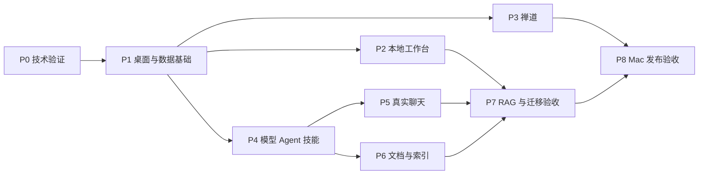

# 个人工作台开发实施与验收文档

版本：1.0 · 2026-09-07 · 状态：已进入开发，验收进度见 [实现记录](IMPLEMENTATION.md)

配套：[架构决策](ARCHITECTURE.md)、[数据与迁移](development/02-data-and-migration.md)、[集成方案](INTEGRATIONS.md)。本文件保留完整 Mac App 的目标计划与验收标准，不因初版打包成功而将全部阶段标为完成。

## 1. 当前基础与交付目标

实施前只有 `ui/index.html`、普通 JavaScript/CSS、示例数据及截图。现已新增 React 和 Tauri 工程。`ui/verification.md` 的历史检查针对静态预览，不能作为数据库、Tauri 原生窗口、真实禅道、模型网络或文件解析的验收证据。

正式交付必须能安装到 Mac，在真实工作空间里创建、修改、重启读取、备份恢复，并完成禅道读取、模型聊天、技能配置、文档解析和知识库检索。内部里程碑可以分别演示，但只有全量验收通过才能称为“完整功能版本”。

原始需求以对话和当前设计为依据；旧文档中的“会话内保存、示例日期、模拟回复、只读文件元信息”是预览限制，不带入正式版本。原型中的固定 `2026-09-07`、`T-*`/`E-*` 示例 ID、硬编码“逾期 1 天”和前端品牌版本必须替换。

## 2. 需求到交付追踪

| 编号 | 正式功能 | 现有视觉/代码参考 | 交付阶段 |
| --- | --- | --- | --- |
| R01 | Mac 窗口、菜单、版本、单实例、空空间 | index.html、refinement.css、32 图 | P1、P8 |
| R02 | 总览四状态、今日安排、近期执行、常用应用 | app.js overviewPage、32 图 | P2 |
| R03 | 任务增改、优先级、备注、筛选、看板/列表、排序、撤销 | app.js detail/newTask/tasksPage、18/33 图 | P2 |
| R04 | 开始/结束日期时间、全天、未排期、跨日、日历月周日列表 | app.js calendarPage、04/33 图 | P2 |
| R05 | 本地项目创建/编辑/归档、来源、关联、统计、按项目看板 | projects.js、project-store.js、13–16 图 | P2 |
| R06 | 禅道 22.0 连接、令牌帮助、项目/执行/任务读取、分页同步 | secondary.js、21/23 图 | P3 |
| R07 | 禅道显式管理、权限检查、预览确认、回读与不确定状态 | app.js remote-preview | P3 |
| R08 | 应用四列、名称/网址/Logo/描述、分类管理、收藏和排序 | secondary.js、categories.js、19/24/25 图 | P2 |
| R09 | 设置横向 Tab、供应商、三种对话协议、向量能力、真实测试、凭据 | models.js、21/22/30 图 | P4、P5 |
| R10 | 多 Agent、提示词/参数、复制、启停、历史版本 | agents.js、10/11/31 图 | P4 |
| R11 | 技能创建、编辑、导入预览、版本、绑定和删除保护 | skills.js、26/31 图 | P4 |
| R12 | 真流式聊天、停止、历史、重命名、删除、复制、选 Agent | chat.js、20/29 图 | P5 |
| R13 | 多知识库、选向量模型、九类文件导入/解析/文档管理 | knowledge.js、27/28/30 图 | P6 |
| R14 | 聊天选知识库、真实检索、可点击来源、重建隔离 | chat.js、29 图 | P7 |
| R15 | 默认 `~/.perch`、设置自定义路径及迁移、重启持久化、schema 升级、备份/恢复、逻辑导入导出 | 数据方案新增设置页 | P1、P7 |
| R16 | 可安装 App、真实 WKWebView 验证、签名、公证和升级 | 现有预览没有对应实现 | P8 |

R07 只承诺经 22.0 实例验证的具体动作，无法调用的动作提供“在禅道中打开”并在验收报告列出能力缺口。不得把入口存在算成远端管理完成。R13 的 DOC/PPT/XLS 旧格式是完整功能范围，不得只测 DOCX/PPTX/XLSX 后宣称九类支持。

## 3. 工程布局

以下是后续创建的计划路径；本轮不创建代码文件。

```text
src/
  app/                    # providers、router、窗口壳、启动/恢复页
  components/             # 公共表单、抽屉、Tab、反馈
  features/               # overview/projects/tasks/calendar/apps/settings
                          # models/agents/skills/chat/knowledge/data-management
  lib/                    # ipc、query keys、errors、datetime
  styles/                 # 复用的语义 tokens 与全局基础样式
src-tauri/
  src/commands/           # 类型化 IPC 参数和返回
  src/application/        # 用例、事务协调、任务调度
  src/domain/             # 业务规则与值对象
  src/infrastructure/     # sqlite、files、keychain、zentao、providers、parser
  migrations/            # 发布后不可修改的编号 SQL
  capabilities/           # 窗口权限
  resources/              # 解析依赖、许可与版本清单
  tests/                  # 事务/故障/adapter 集成测试
tests/
  e2e/                    # React 浏览器交互与视觉回归
  fixtures/               # 脱敏 API 契约、Office/PDF、旧版本数据库
docs/                     # 本轮文档与后续 ADR、原生验收记录
ui/                       # 保留原型与截图作为视觉/行为参考
```

一个领域的页面组件、query hooks、表单 schema 放在同一 feature。React 不导入 Rust SQL schema；IPC DTO 由 Rust 的 serde 类型生成 TS 类型（候选 ts-rs，经 P0 验证）并在 CI 检查产物一致。Zod 用于表单约束，Rust 验证是最终权限和业务边界。

## 4. IPC 与状态契约

命令统一 snake_case，JSON DTO camelCase。稳定 ID 为字符串，时间戳为安全范围内的 UTC 毫秒。列表使用显式分页、排序白名单，关键词不拼接 SQL。错误返回结构：`code`、`message`、`fieldErrors?`、`retryable`、`requestId`；不得直接把带 header/body 的网络错误或 SQL 调试文本回传界面。

| 命令组 | 输入关键字段 | 输出/行为 |
| --- | --- | --- |
| `workspace_get` / `app_info_get` | 当前窗口上下文 | workspace、时区、App/schema 版本、恢复状态 |
| `tasks_query` / `overview_get` | projectId、source、type、status、query、timeWindow、cursor | 同源任务页/汇总，不由前端分别计数 |
| `task_create` / `task_update` | title、projectId、schedule、deadline、expectedRevision、mutationId | 已提交任务及新 revision |
| `task_move` | taskId、toStatus、beforeId?、afterId?、expectedRevision | 原子更新状态与顺序；失败回滚乐观 UI |
| `task_operation_undo` | operationId、expectedRevision | 条件逆操作；已有后续修改时返回冲突 |
| `projects_*` / `apps_*` / `categories_*` | 领域字段及 revision | CRUD、引用保护、分类迁移事务 |
| `credential_set` / `credential_clear` | 槽 ID、提交的密钥 | 仅返回已配置状态；无通用明文读取命令 |
| `zentao_sync_start` | connectionId、scope | jobId；异步更新范围进度 |
| `zentao_operation_prepare` / `confirm` | externalObjectId、action、draft / confirmationId | 有效期内的远端快照、变更确认与结果 |
| `providers_*` / `models_*` / `agents_*` / `skills_*` | 配置、revision、能力 | 配置历史、连接/能力测试和引用保护 |
| `chat_send` | conversationId、text、knowledgeBaseId?、mutationId、channel | generationId；typed Channel 流事件 |
| `chat_cancel` | generationId | 原子停止标记与取消传输，已提交片段保留 |
| `knowledge_import` / `knowledge_reindex` | knowledgeBaseId、经原生选择的文件授权句柄 / modelRevisionId | 持久 jobId、文件校验与代次进度 |
| `data_export` / `data_restore_prepare` / `data_restore_confirm` | format、目标授权句柄 / 包授权句柄 / planId | 校验报告、jobId 或需重启的恢复状态 |
| `storage_location_get` / `storage_move_prepare` / `storage_move_confirm` | 当前上下文 / 目标目录授权句柄 / planId | 生效目录、默认目录、可用性 / 迁移预览 / jobId；校验成功才切换 |

表格是用例契约，不要求采用通用 `*_crud` 命令。实施时为每个实际命令定义 Rust 输入/输出，禁止前端传任意表名、SQL、命令行或系统路径来执行。

写入请求带 `mutationId`，同一空间的已提交操作用有界的去重记录返回原结果，防止双击/IPC 重试重复创建。`expectedRevision` 防陈旧编辑覆盖；请求幂等不代替 revision 检查，也不代替禅道服务端的幂等能力。

低频 `domain_changed` 事件包含实体类型、ID、revision，React 失效相应 Query；事件只是通知，重新打开页面仍从数据库获取状态。高频聊天/作业流使用 Tauri Channel，事件带 generationId/jobId、seq、type；忽略过期代次与重复序号。窗口关闭、重开或丢事件后按 jobId 查库重新附着，不依赖事件历史重建数据。

聊天持久化用户消息和 pending 回复后启动后台生成，不为整个生成过程持有 DB 锁；受限频率提交内容片段。停止必须处理停止与最后一个 token 同时到达的竞态。窗口卸载取消 Channel 订阅，不无意终止已批准的文档索引任务。

## 5. 日期、排序和引用实现细节

- `Schedule` 为带标签联合类型：未排期、全天区间、带时间区间，禁止同时拥有全天日期和时间戳字段。详细约束以数据文档为准。
- 日历查询用半开区间重叠条件；有时长事件满足 `start < windowEnd && end > windowStart`，无结束时间按点事件判断。跨日只拆渲染段，不复制 task 行。
- `normal` 为普通优先级，保持预览 `low/normal/high` 三种；任务来源正式用 `local/zentao`，预览的 `personal` 在明确种子转换中映射。
- 看板按状态 + `sort_key` 排序，首版用有间距整数和必要时同列事务重排。过滤后的移动必须以真实邻居 ID 定位，不能把可见索引当作全列顺序。
- 撤销状态/应用移除采用受控逆操作，检查 revision；不以恢复整个旧对象覆盖后来保存的排期或备注。
- 分类改名仅改分类实体，删除先选择迁移目标；成功再刷新下拉选项，父表单草稿与已选 Logo 始终保留。
- 外部项目、执行、任务按 connection + type + remote ID 去重；同步范围与任务状态筛选不改变统计对象语义。

## 6. 阶段依赖



P2/P3/P4 可在 DTO、事务与领域边界冻结后分人并行。共享 schema 的变更串行审查，migration 编号统一分配；每个子任务限定文件归属，不能多人同时改同一迁移或核心 DTO。每轮不超过五个并行子任务，汇总契约检查后继续下一轮。

下表按交付工作包拆分，复杂工作包实施前再拆成可独立验证的小任务。每项状态均为“未开始”；不因本文写完而勾选实现结果。

## 7. 开发工作包

### P0：高风险技术验证

| 工作包 | 计划文件 | 验证与出口 |
| --- | --- | --- |
| P0.1 创建最小 Mac 壳与锁版本 | package.json、src/app、src-tauri、toolchain/lockfiles | 真 WKWebView 渲染中文，invoke/Channel 往返；固定依赖组合 |
| P0.2 SQLite/Keychain/备份样机 | infrastructure/sqlite、keychain；tests/storage_smoke.rs | 磁盘库重启可读、凭据非明文回显、Online Backup 恢复、FTS5 可用 |
| P0.3 文档解析样机 | infrastructure/parser、resources；fixtures/documents | 真 DOC/DOCX/PPT/PPTX/XLS/XLSX/TXT/MD/PDF；在无开发依赖的 Mac 上启动解析器，记录体积/签名/超时 |
| P0.4 禅道/模型协议核验 | infrastructure/zentao/providers；fixtures/contracts | 实例权限、分页/字段/动作矩阵；真实 streaming/embedding 维度；无实例项明确标未验证 |

P0 不是先把 UI 全重做。若旧 Office 解析或签名失败，应调整解析依赖并更新 ADR，再允许功能阶段依赖该方案；不得临时把文件格式从“支持”改成“只上传”掩盖失败。

### P1：持久化与桌面基础

| 工作包 | 计划文件 | 验证与出口 |
| --- | --- | --- |
| P1.1 领域/迁移与路径 | domain、migrations/0001_*、sqlite、infrastructure/storage_location；tests/migrations.rs、storage_location.rs | 默认 home/.perch、bootstrap 启动定位、外键、revision、空库升级、工作空间锁、较高 schema 拒绝写入 |
| P1.2 BlobStore 与作业 | infrastructure/files、application/jobs；tests/file_commit.rs、jobs.rs | 原子写入、引用事务、崩溃恢复、去重、取消、租约；附件不依赖导入原路径 |
| P1.3 React 壳与 IPC | app/router/providers、components、lib/ipc、capabilities | 导航、Tab、抽屉焦点、原生标题栏和真实版本；Web mock 与 native adapter 明确隔离 |
| P1.4 数据导出基础 | application/data、data-management；tests/backup.rs | 一致备份、manifest/哈希、无密钥、坏包不替换当前库 |
| P1.5 存储位置设置与迁移 | features/data-management/storage、application/storage_move；tests/storage_move.rs | 当前路径、选择/恢复默认、维护锁、跨卷复制校验、原子切换 bootstrap、旧数据保留、失败回退；外接卷离线不创建空库 |

### P2：本地任务、项目、日历与应用

| 工作包 | 计划文件 | 验证与出口 |
| --- | --- | --- |
| P2.1 项目和任务用例 | features/projects/tasks、application/tasks/projects；tests/task_project.rs | 增改关联、重名不同 ID、来源标记、删除保护、重启持久化 |
| P2.2 看板与总览 | features/tasks/board、overview；task-board.test.tsx | 拖拽/键盘移动、列内排序、筛选及乐观回滚；各视图数量一致 |
| P2.3 排期与日历 | domain/schedule、features/calendar；tests/schedule.rs、calendar.test.tsx | 起止/跨日/全天/DST、拖动保时长、拉伸修改、无结束时间、截止独立 |
| P2.4 应用与分类 | features/apps、application/apps；tests/app_category.rs | 四列和描述、Logo 原件复制、URL 校验、分类引用事务、草稿保留、系统浏览器 |

P2 出口是离线可长期使用的本地工作台，属于内部阶段交付；AI、知识库和禅道尚未完成时不能称为用户要求的完整应用。

### P3：禅道完整读取与受控管理

| 工作包 | 计划文件 | 验证与出口 |
| --- | --- | --- |
| P3.1 连接/协议 | features/settings/zentao、infrastructure/zentao；zentao_auth.rs | 真实 Token、帮助、服务子路径、认证失效、权限测试；日志脱敏 |
| P3.2 同步关系 | application/zentao_sync；zentao_sync.rs | 项目→执行→任务、重复/分页/中断、父级补拉、本地覆盖保留、不可访问保留 |
| P3.3 远端管理 | application/remote_operations；zentao_operations.rs | 按对象与权限开放动作、修改预览、确认、失败保留、超时回读，测试实例核验 |

同步 UI 提供范围、最近成功时间、分页进度和脱敏错误记录。断网仍能编辑本地排期。远端修改在专用测试对象上验收，记录修改前后证据，不能使用生产批量改写代替测试。

### P4：模型、Agent 与技能

| 工作包 | 计划文件 | 验证与出口 |
| --- | --- | --- |
| P4.1 供应商和模型 | features/models、infrastructure/providers；provider_contract.rs | 基址/密钥、模型目录、Chat Completions/Responses/Anthropic Messages 三种适配、独立 embedding 能力、真实连接测试、停用/删除保护 |
| P4.2 Agent 和技能 | features/agents/skills、domain/agent；agent_skill.rs | 创建/复制/启停、导入预览和 schema 校验、正文安全显示、immutable revision |

技能首版定义为可选择的提示词和声明配置，按确定顺序进入会话上下文；不执行导入文件中的 shell 或任意脚本。未来工具能力通过受控工具 registry 实现，提示词本身不能赋予权限。

### P5：真实聊天

| 工作包 | 计划文件 | 验证与出口 |
| --- | --- | --- |
| P5.1 流与持久化 | application/chat、commands/chat；chat_stream.rs | 三种协议 SSE 分片/半字符/终止、取消竞态、429/超时、部分回复重启可读、无自动收费重发 |
| P5.2 对话界面 | features/chat；chat.test.tsx、e2e/chat.spec.ts | 选 Agent 新会话、历史快照、重命名/移除/复制、IME Enter、滚动与草稿 |

先完成文本聊天和能力选择。为了兑现当前视觉模型配置，P5 增加 PNG/JPEG/WebP 图片附件（默认单图 10 MB、每轮最多 4 张，实际还需符合供应商限制），经 BlobStore 保存、检查像素尺寸/格式、由适配器编码并真实发送，消息引用管理文件 ID；须提示图片发送目标。只在模型与协议都通过视觉能力验证时开放按钮；不以模型目录中的 `vision` 标识作为已完成证据。视频、音频和任意文件附件不纳入此工作包，知识文档通过知识库导入。

### P6：真实文档处理与知识库索引

| 工作包 | 计划文件 | 验证与出口 |
| --- | --- | --- |
| P6.1 文档接收与解析 | features/knowledge、parser、jobs；document_parse.rs | 原件哈希、九类格式真实内容、页/幻灯片/表格定位、坏包/密码文件/超限错误、取消重试 |
| P6.2 分块与 embedding | application/indexing、domain/chunking；index_generation.rs | 中文/表格分块、模型维度/NaN 检查、重试不重复、进度状态、索引代原子切换 |
| P6.3 检索 | infrastructure/vector、fts；retrieval.rs | 只检索所选库、模型空间隔离、混合排序、中文召回评测、延迟与内存基准 |

扫描 PDF 默认识别为需 OCR，不能当空文本成功；可选 OCR 的入口、数据去向和准确率另行验证。首版必需支持含文本的 PDF 与九类常规文档，扫描件 OCR 是增强项；产品显示与文档必须明确此边界。

### P7：知识库聊天及迁移完成验收

| 工作包 | 计划文件 | 验证与出口 |
| --- | --- | --- |
| P7.1 RAG 闭环 | application/rag、features/chat/citations；rag.rs | 每轮库/索引快照、无召回说明、来源可点击/定位、删除文档即时排除、不跨库泄漏 |
| P7.2 完整恢复与导出 | application/data、features/data-management；restore.rs、logical_roundtrip.rs | NDJSON round-trip、全部正文和原件哈希、旧 schema、部分写入故障、换机密钥重配 |
| P7.3 性能和故障 | tests/benchmarks、tests/failure_injection | 10k 任务、50k 消息、10k chunks；磁盘满/崩溃/睡眠/网络断连有明确恢复结果 |

逻辑包第一版支持恢复至空空间或完整替换，不静默合并冲突。同名不是去重键。PostgreSQL 目标转换契约与 fixture 验证属于迁移准备，实际服务端、认证和设备同步不纳入首版开发。

### P8：Mac 实机、打包与分发

| 工作包 | 计划文件 | 验证与出口 |
| --- | --- | --- |
| P8.1 原生行为验收 | src-tauri 窗口/菜单/平台；docs/native-acceptance.md | WKWebView 下全流程、Keychain、导入/外链、Dock 重开、Quit/睡眠、无进程遗留 |
| P8.2 架构和依赖包 | tauri.conf.json、resources、CI 配置 | arm64 release 安装；x86_64 真验证后开放；无额外 Java/Python/Office 手动安装要求 |
| P8.3 签名/更新/恢复 | 发布配置、updater adapter；docs/release-checklist.md | Developer ID、公证、staple、更新签名、升级备份与失败保护、版本一致 |

首次发布文档记录签名身份、构建版本、安装包哈希、架构、系统版本、解析运行时版本和实际安装结果。缺少证书时可交付明确标注的本机开发包，但不能标记“可正常分发的签名版本”。

## 8. 测试策略与数据集

业务规则测试覆盖状态流转、UTC/时区、引用和删除、修改冲突。SQL 集成测试使用临时真实 SQLite 文件，覆盖事务失败和重启；不能全部使用内存 mock。网络 adapter 使用脱敏响应 fixture 和本地 HTTP/SSE server 验证协议，再用用户配置的测试实例做真实 smoke。

浏览器 Playwright 负责 React 的控件、焦点、滚动、拖拽和截图，接入明确的 mock bridge；真实 Tauri 测试覆盖 invoke 权限、文件、Keychain、WKWebView 差异和包内子进程。macOS 下不能假设现有 Tauri WebDriver 自动化支持与 Windows 相同，采用可执行的原生辅助测试/人工验收记录补齐；Chromium 通过不是 Mac App 通过。

文件 fixture 必须包含正常和损坏的真实文件，不用把字符串命名为 `.ppt` 来证明 PPT 可解析。Word 检查标题/段落/表格，Excel 检查 sheet、单元格、日期、公式缓存和空值，PPT 检查页序和文字，PDF 检查页号/中文/扫描页，TXT/MD 检查编码、换行与特殊字符。不得运行宏或自动抓取文档中的远程资源。

知识检索测试集建议从脱敏中文资料构建至少 30 个问题，标记应命中的文件、页/表及无答案问题；评估 Recall@5、引用有效率和无答案行为。模型回答文字不宜做脆弱的逐字匹配；引用必须来自本次真实检索上下文。

后续工程需要提供统一脚本，建议契约如下（当前尚不存在，不是本轮已运行命令）：

```sh
pnpm install --frozen-lockfile
pnpm typecheck
pnpm lint
pnpm test
pnpm test:e2e
pnpm build
cargo fmt --manifest-path src-tauri/Cargo.toml --check
cargo clippy --manifest-path src-tauri/Cargo.toml --all-targets -- -D warnings
cargo test --manifest-path src-tauri/Cargo.toml
pnpm tauri dev
pnpm tauri build --target aarch64-apple-darwin
```

CI 单元测试超时按单测试/套件设定，普通用例默认 60 秒内结束；大文件解析和网络 fixture 用明确更长上限，禁止无限等待。分发 gate 需要安装包实测报告，不仅查看命令退出码。

## 9. 完整功能版完成定义

- [ ] R01–R16 逐条具有测试或实机证据；受禅道版本限制的动作有准确矩阵。
- [ ] 清空演示条件后能创建真实任务/项目/应用/技能/知识库，退出并重启仍在。
- [ ] 总览、看板、列表、日历、项目详情使用同一数据，改动与撤销一致。
- [ ] 禅道同步真实成功且关系正确；权限/网络失败不误删，本地状态不被覆盖。
- [ ] 供应商凭据进入 Keychain；真实聊天可停止、可看历史，UI 不再用演示回复冒充。
- [ ] 九类正常文件可解析并生成向量，聊天检索所选库并显示有效来源。
- [ ] 重建/删除/改模型时不存在混代检索或跨库召回；错误和恢复路径可操作。
- [ ] 完整备份和逻辑数据包均通过换目录/换空间恢复，附件哈希与关系一致。
- [ ] 默认使用 `~/.perch`；设置切换存储路径后重启数据完整，权限/空间/断电/卷离线异常不会丢数据或静默创建空库。
- [ ] 从每个已发布 schema 升级可用；损坏包、较新 schema、磁盘不足不破坏旧数据。
- [ ] Mac 安装、原生窗口、输入法、文件、Keychain、子进程和退出行为通过实测。
- [ ] 可分发包完成签名、公证与架构标记；无未说明的用户侧解析依赖。
- [ ] 文档记录实际依赖版本、性能数据、已知限制；不引用原型 17/23 项检查代替本轮原生验收。

## 10. 实施前评审清单

先确认推荐的 SQLite 混合存储、Mac 架构目标、正式跨日排期及解析运行时体积取舍。之后进入 P0，将验证得到的确切依赖版本、禅道 API 能力和安装包约束补入 ADR，再实施其余工作包。

用户提供禅道与模型连接信息时通过应用配置/受控凭据槽注入，不写进本文或 fixture。产品正式名称、bundle ID、签名身份应在第一份正式用户数据产生前固定；更改它们必须附应用目录和 Keychain 迁移步骤。
